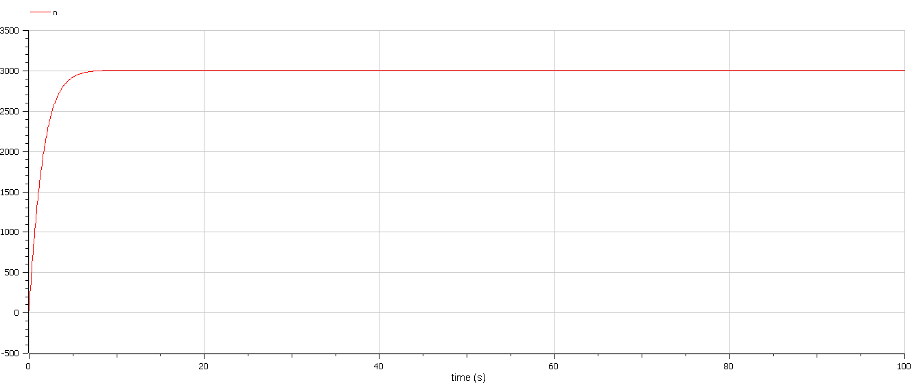
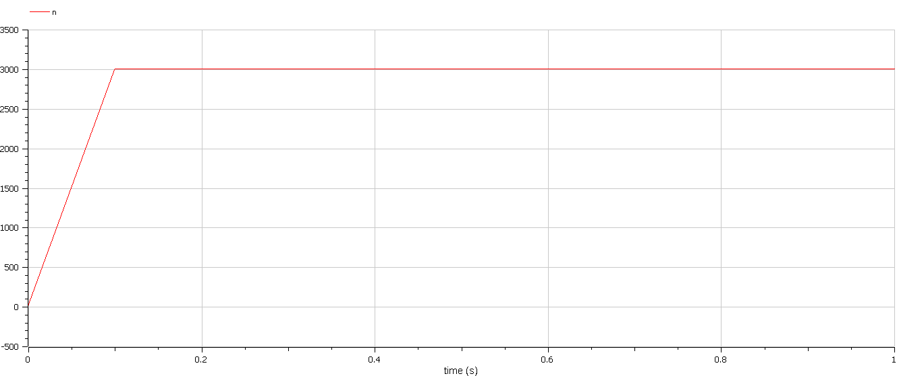
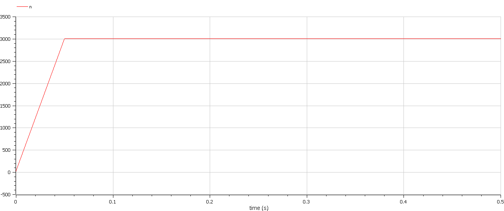

<style>
section::after {
  content: attr(data-marpit-pagination) ' / ' attr(data-marpit-pagination-total);
}
img[alt="center"] {
     display: block;
     margin: 0 auto;
}
h1 {
    font-size: 60px;
    text-align: center;
}
h2 {
    font-size: 30px;
    text-align: left;
    position: relative;
    left: -2em;
    line-height: 0px;
    top: 8em;
}
h3 {
    font-size: 40px;
    text-align: left;
    position: relative;
    left: -0.5em;
    bottom: 0.2em;
}
h4 {
    font-size: 25px;
    text-align: center;
    position: relative;
    left: -0.5em;
    bottom: 0.2em;
}
</style>

# Лабораторная работа №7
## Василий Худицкий 
## РУДН, 2022, Москва, Россия

---

# Прагматика лабораторной работы

- Знакомство с моделью распространения рекламы.

- Визуализация результатов моделирования путем построения графиков распространения рекламы.

---

# Цель лабораторной работы

- Научиться строить математическую модель распространения рекламы.
- Построить графики распространения информации о товаре и сравнить эффективность рекламной компании для трёх случаев.

---

### Задание лабораторной работы

Постройте график распространения рекламы, математическая модель которой описывается следующим уравнением:

1. $\frac{dn}{dt}=(0.566+0.000066n(t))(N-n(t))$
2. $\frac{dn}{dt}=(0.000044+0.244n(t))(N-n(t))$
3. $\frac{dn}{dt}=(0.44t+0.34cos(t)n(t))(N-n(t))$

При этом объем аудитории $N = 3010$, в начальный момент о товаре знает 23 человека. Для случая 2 определите в какой момент времени скорость распространения рекламы будет иметь максимальное значение.

---

# Результаты выполнения лабораторной работы

---

# Случай 1 (если $\alpha_1(t) \gg \alpha_2(t)$)

```Modelica
  model lab07case1
  constant Real a_1=0.566; //коэффициент alpha_1
  constant Real a_2=0.000066; //коэффициент alpha_2
  constant Real N=3010; //объем аудитории

  Real n; //количество людей, знающих о товаре

 initial equation
  n=23; //количество людей, знающих о товаре в начальный момент времени

 equation
  der(n)=(a_1+a_2*n)*(N-n);
 end lab07case1;
```

---

#### 
##### Рис.1 График распространения информации о товаре для случая 1

---

# Случай 2 (если $\alpha_1(t) \ll \alpha_2(t)$)

```Modelica
  model lab07case2
  constant Real a_1=0.000044; //коэффициент alpha_1
  constant Real a_2=0.244; //коэффициент alpha_2
  constant Real N=3010; //объем аудитории

  Real n; //количество людей, знающих о товаре

 initial equation
  n=23; //количество людей, знающих о товаре в начальный момент времени

 equation
  der(n)=a_1*(N-n)+a_2*n*(N-n);
 end lab07case2;
```

---

#### 
##### Рис.2 График распространения информации о товаре для случая 2

---

# Случай 3

```Modelica
 model lab07case3
  constant Real N=3010; //объем аудитории

  Real a_1; //коэффициент alpha_1
  Real a_2; //коэффициент alpha_2
  Real n; //количество людей, знающих о товаре

 initial equation
  n=23; //количество людей, знающих о товаре в начальный момент времени

 equation
  a_1 = 0.44*time;
  a_2 = 0.34*cos(time);
  der(n)=(a_1+a_2*n)*(N-n);
 end lab07case3;
```
---

#### 
##### Рис.3 График распространения информации о товаре для случая 3

---

# Выводы
- Научился строить математическую модель распространения рекламы.
- Построив графики распространения рекламы для трёх случаев, выяснил, что информация о товаре распространяется быстрее всего в случае 3.
