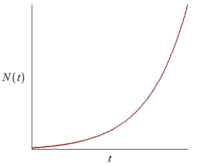
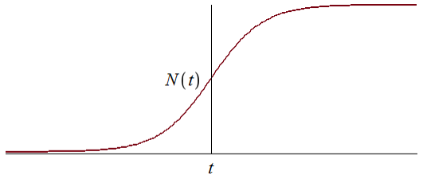
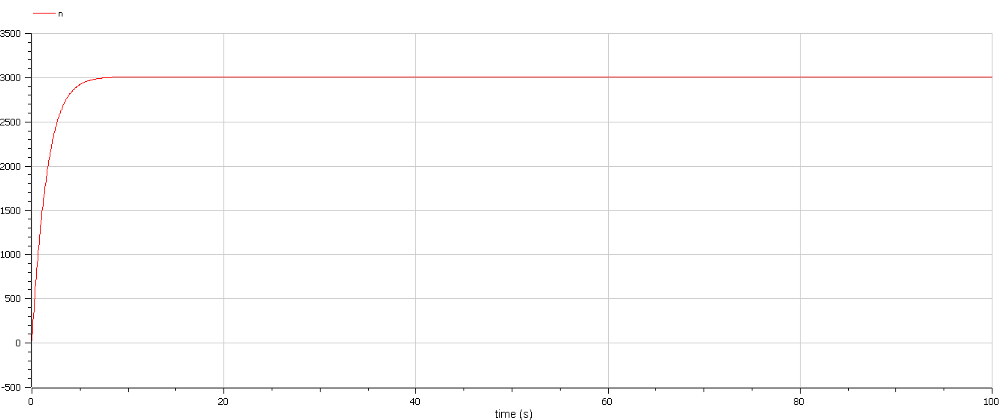
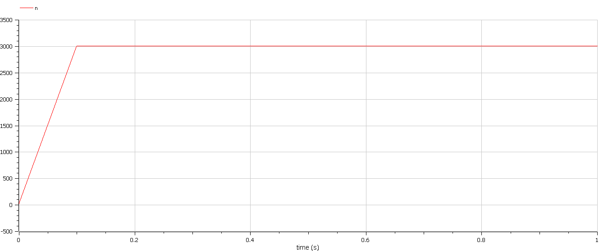
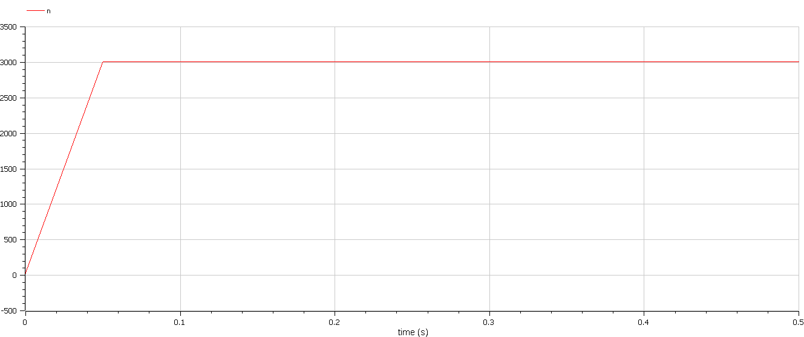

---
# Front matter
title: "Отчёт по лабораторной работе №7"
subtitle: "Вариант 44"
author: "Василий Олегович Худицкий"

# Generic otions
lang: ru-RU
toc-title: "Содержание"

# Pdf output format
toc: true # Table of contents
toc_depth: 2
lof: true # List of figures
lot: true # List of tables
fontsize: 12pt
linestretch: 1.5
papersize: a4
documentclass: scrreprt
## I18n
polyglossia-lang:
  name: russian
  options:
	- spelling=modern
	- babelshorthands=true
polyglossia-otherlangs:
  name: english
### Fonts
mainfont: PT Serif
romanfont: PT Serif
sansfont: PT Sans
monofont: PT Mono
mainfontoptions: Ligatures=TeX
romanfontoptions: Ligatures=TeX
sansfontoptions: Ligatures=TeX,Scale=MatchLowercase
monofontoptions: Scale=MatchLowercase,Scale=0.9
## Biblatex
biblatex: true
biblio-style: "gost-numeric"
biblatexoptions:
  - parentracker=true
  - backend=biber
  - hyperref=auto
  - language=auto
  - autolang=other*
  - citestyle=gost-numeric
## Misc options
indent: true
header-includes:
  - \linepenalty=10 # the penalty added to the badness of each line within a paragraph (no associated penalty node) Increasing the value makes tex try to have fewer lines in the paragraph.
  - \interlinepenalty=0 # value of the penalty (node) added after each line of a paragraph.
  - \hyphenpenalty=50 # the penalty for line breaking at an automatically inserted hyphen
  - \exhyphenpenalty=50 # the penalty for line breaking at an explicit hyphen
  - \binoppenalty=700 # the penalty for breaking a line at a binary operator
  - \relpenalty=500 # the penalty for breaking a line at a relation
  - \clubpenalty=150 # extra penalty for breaking after first line of a paragraph
  - \widowpenalty=150 # extra penalty for breaking before last line of a paragraph
  - \displaywidowpenalty=50 # extra penalty for breaking before last line before a display math
  - \brokenpenalty=100 # extra penalty for page breaking after a hyphenated line
  - \predisplaypenalty=10000 # penalty for breaking before a display
  - \postdisplaypenalty=0 # penalty for breaking after a display
  - \floatingpenalty = 20000 # penalty for splitting an insertion (can only be split footnote in standard LaTeX)
  - \raggedbottom # or \flushbottom
  - \usepackage{float} # keep figures where there are in the text
  - \floatplacement{figure}{H} # keep figures where there are in the text
---

# Цель работы

- Научиться строить математическую модель распространения рекламы.
- Построить графики распространения информации о товаре и сравнить эффективность рекламной компании для трёх случаев.


# Задание

Постройте график распространения рекламы, математическая модель которой описывается следующим уравнением:
1. $$\frac{dn}{dt}=(0.566+0.000066n(t))(N-n(t))$$
2. $$\frac{dn}{dt}=(0.000044+0.244n(t))(N-n(t))$$
3. $$\frac{dn}{dt}=(0.44t+0.34cos(t)n(t))(N-n(t))$$

При этом объем аудитории N = 3010 , в начальный момент о товаре знает 23 человека. Для случая 2 определите в какой момент времени скорость распространения рекламы будет иметь максимальное значение.

# Теоретическое введение

## Эффективность рекламы
​	Организуется рекламная кампания нового товара или услуги. Необходимо, чтобы прибыль будущих продаж с избытком покрывала издержки на рекламу. Вначале расходы могут превышать прибыль, поскольку лишь малая часть потенциальных покупателей будет информирована о новинке. Затем, при увеличении числа продаж, возрастает и прибыль, и, наконец, наступит момент, когда рынок насытиться, и рекламировать товар станет бесполезным.

​	Предположим, что торговыми учреждениями реализуется некоторая продукция, о которой в момент времени $t$ из числа потенциальных покупателей $N$ знает лишь $n$ покупателей. Для ускорения сбыта продукции запускается реклама по радио, телевидению и других средств массовой информации. После запуска рекламной кампании информация о продукции начнет распространяться среди потенциальных покупателей путем общения друг с другом. Таким образом, после запуска рекламных объявлений скорость изменения числа знающих о продукции людей пропорциональна как числу знающих о товаре покупателей, так и числу покупателей о нем не знающих.

​	Модель рекламной кампании описывается следующими величинами. Считаем, что $\frac{dn}{dt}$ - скорость изменения со временем числа потребителей, узнавших о товаре и готовых его купить, $t$ - время, прошедшее с начала рекламной кампании, $n(t)$ - число уже информированных клиентов. Эта величина пропорциональна числу покупателей, еще не знающих о нем, это описывается следующим образом: $\alpha_1(t)(N-n(t))$, где $N$ - общее число потенциальных платежеспособных покупателей, $\alpha_1(t)>0$ - характеризует интенсивность рекламной кампании (зависит от затрат на рекламу в данный момент времени). Помимо этого, узнавшие о товаре потребители также распространяют полученную информацию среди потенциальных покупателей, не знающих о нем (в этом случае работает т.н. сарафанное радио). Этот вклад в рекламу описывается величиной $\alpha_2(t)(N-n(t))$ , эта величина увеличивается с увеличением потребителей узнавших о товаре. Математическая модель распространения рекламы описывается уравнением:
$$\frac{dn}{dt}=(\alpha_1(t)+\alpha_2(t)n(t))(N-n(t))$$
​	При $\alpha_1(t) >> \alpha_2(t)$ получается модель типа модели Мальтуса, решение которой имеет вид (рис. [-@fig:001]):

{#fig:001}

​	В обратном случае, при $\alpha_1(t) << \alpha_2(t)$ получаем уравнение логистической кривой (рис. [-@fig:002]):

{#fig:002}

## Ответы на вопросы к лабораторной работе

1. Записать модель Мальтуса (дать пояснение, где используется данная модель)
$$ \frac{dx}{dt} = (\alpha-\beta)x $$

где $\alpha$ и $\beta$ - коэффициенты рождения и смертности соответственно.

Используется в биологии для моделирования динамики численности популяций, описывает неограниченный рост популяции.

2. Записать уравнение логистической кривой (дать пояснение, что описывает данное уравнение)
$$
\frac{dx}{dt} = rx(1 - \frac{x}{K})
$$
где К - емкость экологической ниши популяции.
Используется в биологии для моделирования ограниченного роста популяции.

3. На что влияет коэффициент  $\alpha_1(t)$ и $\alpha_2(t)$ в модели распространения рекламы в модели распространения рекламы

$\alpha_1(t)>0$ — характеризует интенсивность рекламной кампании (зависит от затрат на рекламу в данный момент времени), а $\alpha_2(t)$ — это коэффициент интенсивности сарафанного радио.

4. Как ведет себя рассматриваемая модель при $\alpha_1(t) \gg \alpha_2(t)$

При $\alpha_1(t) >> \alpha_2(t)$ получается модель типа модели Мальтуса, решение которой имеет вид (рис. [-@fig:001])

5. Как ведет себя рассматриваемая модель при $\alpha_1(t) \ll \alpha_2(t)$

При $\alpha_1(t) << \alpha_2(t)$ получаем уравнение логистической кривой (рис. [-@fig:002])

# Выполнение лабораторной работы

## 1. Случай 1 (если $\alpha_1(t) \gg \alpha_2(t)$)

Код на Modelica:
```Modelica
 model lab07case1
  constant Real a_1=0.566; //коэффициент alpha_1
  constant Real a_2=0.000066; //коэффициент alpha_2
  constant Real N=3010; //объем аудитории

  Real n; //количество людей, знающих о товаре

 initial equation
  n=23; //количество людей, знающих о товаре в начальный момент времени

 equation
  der(n)=(a_1+a_2*n)*(N-n);
 end lab07case1;
```
График распространения информации о товаре(рис. [-@fig:003]):
{#fig:003}

## 2. Случай 2 (если $\alpha_1(t) \ll \alpha_2(t)$)

Код на Modelica:
```Modelica
 model lab07case2
  constant Real a_1=0.000044; //коэффициент alpha_1
  constant Real a_2=0.244; //коэффициент alpha_2
  constant Real N=3010; //объем аудитории

  Real n; //количество людей, знающих о товаре

 initial equation
  n=23; //количество людей, знающих о товаре в начальный момент времени

 equation
  der(n)=a_1*(N-n)+a_2*n*(N-n);
 end lab07case2;
```
График распространения информации о товаре(рис. [-@fig:004]):
{#fig:004}
Распространение информации о товаре достигает максимума в момент $t=0.1$

## 3. Случай 3

Код на Modelica:
```Modelica
 model lab07case3
  constant Real N=3010; //объем аудитории

  Real a_1; //коэффициент alpha_1
  Real a_2; //коэффициент alpha_2
  Real n; //количество людей, знающих о товаре

 initial equation
  n=23; //количество людей, знающих о товаре в начальный момент времени

equation
  a_1 = 0.44*time;
  a_2 = 0.34*cos(time);
  der(n)=(a_1+a_2*n)*(N-n);
end lab07case3;
```
График распространения информации о товаре(рис. [-@fig:005]):
{#fig:005}

# Выводы
- Научился строить математическую модель распространения рекламы.
- Построив графики распространения рекламы для трёх случаев, выяснил, что информация о товаре распространяется быстрее всего в случае 3.


# Список литературы

- <code>[Кулябов Д.С. *Лабораторная работа №7*](https://esystem.rudn.ru/mod/resource/view.php?id=831053)</code>
- <code>[Кулябов Д.С. *Задания к лабораторной работе №7 (по вариантам)*](https://esystem.rudn.ru/mod/resource/view.php?id=831054)</code>
- Г.Ю. Ризниченко. Лекции по математическим моделям в биологии [Электронный ресурс] // Справочник "Биофизики России". URL:(http://library.biophys.msu.ru/LectMB/Lect03.htm) (дата обращения: 25.03.2022).